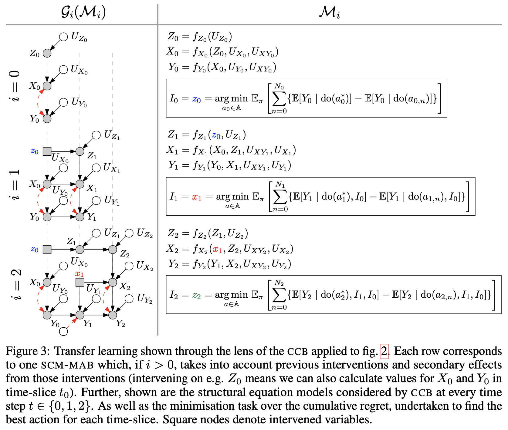

# Non-stationary (actually piecewise stationary) SCM-MAB i.e.  chronological causal bandit

This paper studies an instance of the multi-armed bandit (MAB) problem, specifically where several causal MABs operate chronologically in the same dynamical system. Practically the reward distribution of each bandit is governed by the same non-trivial dependence structure, which is a dynamic causal model. Dynamic because we allow for each causal MAB to depend on the preceding MAB and in doing so are able to transfer information between agents. Our contribution, the Chronological Causal Bandit (CCB), is useful in discrete decision-making settings where the causal effects are changing across time and can be informed by earlier interventions in the same system. In this paper, we present some early findings of the CCB as demonstrated on a toy problem.

Visual representation of model and method.



## TL;DR

1. [DCBO](https://github.com/neildhir/DCBO/tree/master) takes continuous actions (interventions) in a dynamical system modelled as a dynamic causal diagram.
2. CCB (this paper) takes discrete actions (interventions) in a dynamical system modelled as a dynamic causal diagram.

## Installation

1. Go to the [SCM-MAB code repo](https://github.com/sanghack81/SCMMAB-NIPS2018) and install that package first (make sure to run `pip install .` from that base directory).
2. Clone this repo and install this package using

```python
pip install -e .
```

## Paper

This work is published in [this paper](https://arxiv.org/pdf/2112.01819.pdf).

## Implementation

This implementation builds heavily upon the original [SCM-MAB code](https://github.com/sanghack81/SCMMAB-NIPS2018).

## Usage

A comprehensive example can be found in `examples/ccb_demo.ipynb` or if you really want to hit the ground running, you can use the following code snippet:

```python
from src.examples.example_setup import setup_DynamicIVCD
from src.ccb import CCB

params = setup_DynamicIVCD()
m = CCB(**params)
m.run()
```

## Cite

If you use this code in your research, please consider citing:

```bib
@inproceedings{CCB,
 author = {Dhir, Neil},
 booktitle = {NeurIPS 2021 workshop Causal Inference Challenges in Sequential Decision Making: Bridging Theory and Practice}
 title = {Chronological Causal Bandits}
 volume = {35},
 year = {2021}
}
```

## License

This repository is MIT licensed, as found in the [LICENSE](LICENSE) file.